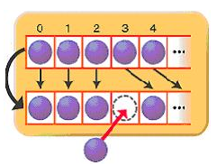
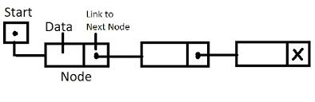

# LinkedList summary

## ArrayList
* 내부적으로 데이터를 Array에서 관리
* 데이터 추가/삭제시 다음과 같은 데이터 복사가 발생.

* 대량의 자료를 추가/삭제하는 경우에는 그만큼 복사 비용이 발생.
* 복사가 많이 발생하면 성능저하.
* 각 데이터 인덱스를 가지고 있기 때문에 한번에 참조가 가능.
* 데이터 검색이 유리.
----

## LinkedList

* LinkedList는 데이터를 저장하는 각 노드가 이전 노드와 다음 노드의 상태만 알고 있다.

* ArrayList와 같이 데이터의 추가/삭제시 불필요한 데이터 복사가 없다.
* 반면 검색시에는 처음부터 노드를 순회하기 때문에 성능상 불리하다.